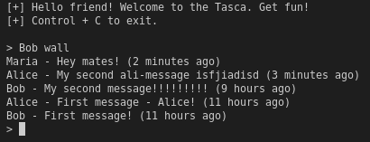

<!-- PROJECT LOGO -->
<br />
<p align="center">
  <a href="https://github.com/othneildrew/Best-README-Template">
    
  </a>

<!-- TABLE OF CONTENTS -->
<details open="open">
  <summary><h2 style="display: inline-block">Table of Contents</h2></summary>
  <ol>
    <li>
      <a href="#about-the-project">About The Project</a>
    </li>
    <li>
      <a href="#getting-started">Getting Started</a>
      <ul>
        <li><a href="#prerequisites">Prerequisites</a></li>
        <li><a href="#installation">Installation</a></li>
      </ul>
    </li>
    <li><a href="#usage">Usage</a></li>
    <li><a href="#requirements">Requirements</a></li>
    <li><a href="#todo">TODO</a></li>
    <li><a href="#contact">Contact</a></li>
  </ol>
</details>

<!-- ABOUT THE PROJECT -->
## About The Project



Sample project using Python 3.8 and MongoDB without frameworks based in Hexagonal architecture design.

A Tasca is a typical Spanish bar. Like in a Tasca, you can talk (post messages), meet people (following), "remember" your words (see your posts) or listen the environment (read your wall with all your messages along with your follow users messages).

<!-- GETTING STARTED -->
## Getting Started
  
### Prerequisites

* [Python 3.8](https://www.python.org/downloads/release/python-380/)
* [MongoDB](https://www.mongodb.com/es)
* [Docker](https://www.docker.com/)
* [Docker compose](https://docs.docker.com/compose)

### Installation

1. Clone the repo
   ```sh
   git clone https://github.com/jesuschm/tasca.git
   ```
2. Export project path
   ```sh
   export PYTHONPATH=[project-path]/tasca/
   cd [project-path]/tasca/
   ```
3. Docker compose
  ```sh
    docker-compose up -d
  ```
4. Create and activate the virtual environment (<a href="https://docs.python.org/3/using/index.html">info</a>)
5. Install requirements
  ```sh
    pip install -r requirements.txt
  ```
6. Create users
  ```sh
  python src/scripts/createuser.py [username]
  ```

<!-- USAGE EXAMPLES -->
### Usage

You have 4 commands:
1. Post messages.
2. Follow another user.
3. Read your messages.
4. Read your wall.

<!-- TODO -->
## TODO
1. Tests, tests and more tests (at least until the 80%)
2. Actually you can follow yourself (it's ok you love yourself but if you follow yourself is like when you give a like to your photos).

<!-- CONTACT -->
## Contact

Your Name - [@jchaconmontero](https://twitter.com/jchaconmontero) - jesuschaconmontero@gmail.com

Project Link: [https://github.com/jesuschm/tasca](https://github.com/jesuschm/tasca)
